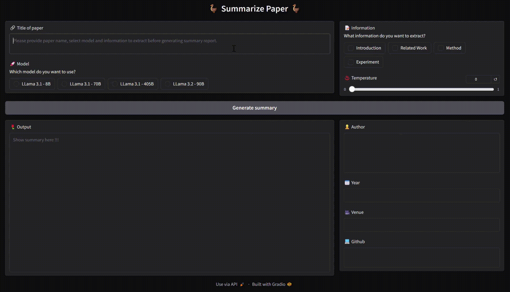
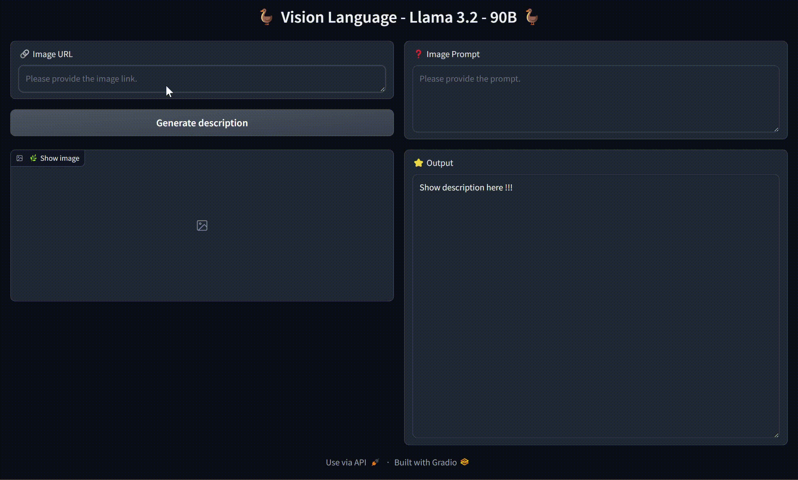

# Summary of paper using Llama 3.2

An offline web application using [gradio](https://www.gradio.app/) and the LLM Llama 3.1 and Llama 3.2 to support paper summarization.

## :collision: Demo :collision:




## :hammer_and_wrench: Installation :hammer_and_wrench:

### Install using Pip

Environment: `python=3.1x`

```
pip install -r requirements.txt
```
### Run application
```
python app.py
```


## :gift: Acknowledgement :gift:

This repo is build upon a [DeepLearning.AI](https://www.deeplearning.ai/short-courses/introducing-multimodal-llama-3-2/) course.